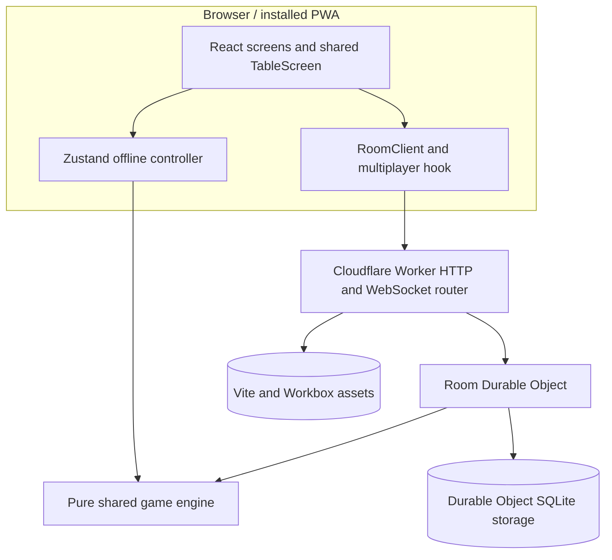
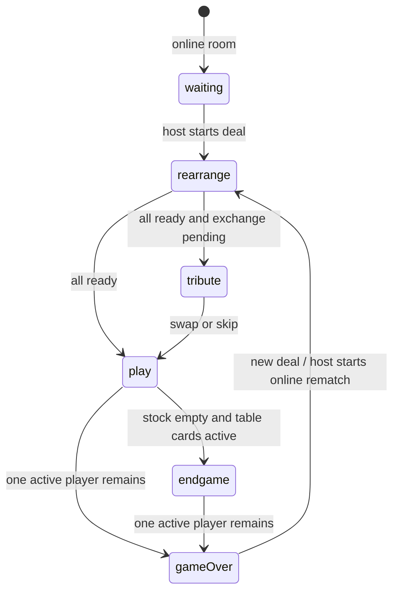

# Shithead

A mobile-first implementation of the Shithead shedding card game, built as an installable React PWA with local pass-and-play, Easy/Medium/Hard AI policies, and server-authoritative online rooms on Cloudflare Workers and Durable Objects.

- **Production (canonical):** <https://shead.online>
- **Fallback/diagnostic endpoint:** <https://shithead.not4a6f7365.workers.dev>
- **Application version:** `0.2.0`
- **Wire protocol:** `5`
- **Persistent room schema:** `3`
- **Runtime:** Node.js `>=22`, modern evergreen browsers, Cloudflare Workers

This document is the technical source of truth for the shipped game. Rule behavior is defined by the pure engine in [`app/src/engine/index.ts`](app/src/engine/index.ts); multiplayer trust boundaries and wire validation are defined by [`app/src/engine/protocol.ts`](app/src/engine/protocol.ts) and [`app/src/worker/index.ts`](app/src/worker/index.ts).

## Product capabilities

| Area | Current implementation |
|---|---|
| Offline play | 2–5 seats on one device; any mix of humans and Easy/Medium/Hard AI |
| Online play | Private rooms for 2–5 human players over WebSocket |
| Round configuration | 1–3 decks, Jokers on/off, optional previous-winner face-up exchange |
| Rules | 2 reset, 3 mirror, 7 low, stacked 8 skip, 10 burn except after 7, Joker burn, cumulative four-plus burn, out-of-turn burn-in, exact drawn-card quick follow-up |
| Refresh recovery | Online seats resume with a rotating secret token stored locally |
| Installation | Standalone PWA with an auto-updating Workbox app shell |
| Sharing | Six-character room code, native Web Share, full-link clipboard/select fallback |
| Accessibility | Native card buttons, pressed state, live announcements, focus-managed dialogs, keyboard shortcuts, reduced-motion mode |
| Responsive table | Portrait and landscape layouts, safe-area support, Visual Viewport correction, count-invariant horizontally scrolling hand |
| Observability | Structured Worker logs and Cloudflare observability; no product analytics or advertising SDK |

Online rooms do not currently contain AI seats. Offline games live in Zustand memory and restart on refresh; secure refresh recovery applies to online rooms only.

## Technology stack

| Layer | Technology |
|---|---|
| UI | React 18, TypeScript (declared `^5.6.3`, lockfile `5.9.3`), Tailwind CSS 3.4, handwritten CSS design tokens |
| Local controller | Zustand 4.5 |
| Motion | Framer Motion 11 with reduced-motion branches |
| Frontend build | Vite 5, `vite-plugin-pwa`, Workbox |
| Shared rules | Dependency-free pure TypeScript reducers |
| Transport | Versioned JSON messages over native WebSocket |
| Edge runtime | Cloudflare Workers, Wrangler 4 |
| Room authority | One SQLite-backed Durable Object per room code |
| Tests | Vitest 2, Testing Library, jsdom, a live local-Worker adversarial script, and a production WebSocket smoke test |

## System architecture

The same pure engine executes local actions and authoritative online actions. The browser never becomes authoritative in an online room.



### Authority boundaries

1. The client sends intent: card identifiers, swaps, pickup, ready state, rule patches, or tribute decisions.
2. The room Durable Object serializes all inbound frames through one promise chain.
3. The Worker resolves submitted IDs against the authoritative player zones and discards submitted rank/suit data.
4. The shared reducer validates turn, phase, zone, rank, ownership, and game-specific invariants.
5. Accepted state is persisted before a viewer-specific state is broadcast.
6. Each client ignores stale or replayed state sequences.

There is no generic action request ID, ACK, or client-side optimistic state mutation. Replay resistance comes from authoritative ownership/turn validation, serialized room operations, and monotonic state sequencing.

## Game rules

### Configurable rules

```ts
interface GameRules {
  includeJokers: boolean
  winnerSwapsFaceUp: boolean
  deckCount: 1 | 2 | 3
}
```

Defaults are one deck, Jokers enabled, and winner exchange disabled.

Each deck contains 52 standard cards and, when enabled, two Jokers. The supported totals are therefore 52/104/156 cards without Jokers or 54/108/162 cards with Jokers. Card IDs are opaque random values and remain unique across all decks in a deal.

The core engine accepts 2–6 seats and separately verifies that the selected decks can supply nine cards per player. The shipped offline setup and online protocol intentionally cap the product at 2–5 seats.

### Deal and rearrangement

Each player receives nine cards:

- three fixed face-down cards;
- three initially face-up cards;
- three cards in hand.

The six visible cards form the setup pool. During `rearrange`, a player may swap any hand position with any face-up position, allowing all $\binom{6}{3}=20$ possible three-card public rows. Face-down cards cannot be inspected or rearranged.

Online play begins only after every seat sends `READY`. A later rearrangement removes that player's ready state. Offline AI players rearrange automatically and are pre-ready.

The opening player is recalculated from the finalized face-up rows using this priority:

```text
3 → 4 → 5 → 6 → 7 → 8 → 9 → 10 → J → Q → K → A → 2 → Joker
```

Hands never determine the opener. Equal priorities resolve to the first matching seat in player-array order.

### Phase machine



`lobby` is used by the local controller before a deal. `roundEnd` remains in the TypeScript phase union for snapshot compatibility but is not produced by current reducers.

### Active card zones

A player must play from exactly one active zone:

1. `hand`, while it contains any card;
2. `faceUp`, only after the hand is empty;
3. `faceDown`, only after both hand and face-up cards are empty.

After an accepted visible play, the player draws from stock until the hand contains three cards or the stock is empty. A player who picked up above three does not draw until their hand falls below three. Pickup itself never draws from stock.

If that refill contains the same printed rank that was just played, only the exact newly drawn card identifiers become eligible for a quick follow-up. The player may add them while the next turn is already live, provided the request reaches the authoritative game before another gameplay action is accepted. Pre-existing cards of that rank do not qualify.

### Ordinary play and pickup

- An empty or reset pile may be opened with any rank.
- A normal action may contain one card or any selected subset of cards with exactly one printed rank.
- Mixed-rank sets are invalid. A Joker cannot substitute for another rank.
- Ordinary cards must equal or exceed the effective top rank, except when a 7 reverses that comparison.
- Pickup is voluntary even when the player has a legal card.
- Pickup moves the complete live pile into the player's hand, clears the pile, draws nothing, and advances the turn.
- Pickup is rejected when the pile is empty or the phase is not `play`/`endgame`.
- The UI asks for a second confirmation within three seconds when a legal play exists, preventing accidental pickup without removing the rule choice.

### Special ranks

| Rank or condition | Exact behavior |
|---|---|
| `2` | Playable on anything. It is a reset boundary, so any card may follow. Physical 2s still count as printed 2s toward a four-plus burn. |
| `3` | Playable on anything. It mirrors the first effective rank below a chain of 3s. Above a 2, or with no non-3 beneath it, play remains unrestricted. It mirrors rank legality only and does not repeat an 8 skip. |
| `7` | The next ordinary card must be 7 or lower. The play-anytime 2, 3, and Joker remain valid; **10 is not exempt**. A 3 above a 7 preserves the low restriction. |
| `8` | Each 8 skips one additional active player. Already-out seats do not count. A four-plus 8 burn takes precedence over skipping. |
| `10` | Burns the pile immediately. It is normally unrestricted, but cannot be played on an effective 7. |
| Joker | Playable on anything and burns immediately. It is not a rank-substitution wildcard and cannot be mixed into another set. |
| Physical top run `>=4` | An uninterrupted run of four or more equal printed ranks burns, whether produced in one action or accumulated across actions. Multi-deck games may burn more than four. |

A burn removes the entire pile and the newly played cards from the game; there is no burn-discard zone. The actor leads again on an empty pile unless that action made them go out, in which case the next active player leads.

`playDirection` is retained in state for compatibility and is honored by seat traversal, but no current rank reverses direction and new games initialize it to `1`.

### Drawn-card quick follow-up

An accepted normal play from `hand` or `faceUp` may open a short, race-based follow-up opportunity after refill:

- the entitlement contains only exact card IDs drawn by that action whose printed rank equals the played rank;
- a same-rank card that was already in hand is never eligible, even though it is owned by the player;
- blind plays and any play that clears the pile do not open a follow-up;
- the player may submit one eligible replacement at a time; unused eligible cards survive, and a newly drawn matching replacement can extend the chain;
- each accepted follow-up is a full engine mutation: it refills toward three, increments `seq` and `turnCount`, and emits `PLAY_CARDS` plus `QUICK_FOLLOW_UP` events;
- a quick 8 adds another skip to the turn already calculated; completing a physical four-plus run burns and gives the actor the empty-pile lead;
- the first accepted competing play, pickup, or burn-in closes the opportunity. Rejected actions, chat, and reactions do not;
- in the two-player stacked-8 edge, where the actor remains current, choosing a normal play or pickup declines the follow-up and proceeds with normal-turn semantics.

Online requests carry the exact authoritative sequence that exposed the entitlement. The Durable Object serializes competing frames, so the first accepted mutation wins deterministically; stale, duplicate, forged, wrong-player, and reconnect-replayed requests cannot apply. Offline AI uses an eligible replacement automatically. Pass-and-play keeps the prior player's hand visible until that player acts or explicitly passes the device onward.

### Out-of-turn burn-in

Any non-current, non-out player may interrupt only when all of these conditions hold:

- phase is `play` or `endgame`;
- the pile has a physical top run of one to three cards of one printed rank;
- the player is using a visible active zone (`hand`, otherwise `faceUp`; never `faceDown`);
- every submitted card matches the physical top rank;
- the player submits **all** matching cards from that active zone;
- existing run plus submitted cards totals at least four.

The accepted interrupt refills the actor toward three cards, burns the pile, increments the action sequence, and gives the interrupter the empty-pile lead. Concurrent online interrupts are serialized, so only the first still-valid request succeeds. AI can complete a cumulative burn during its normal turn but does not autonomously initiate an out-of-turn interrupt.

### Blind face-down play

A blind action always selects exactly one face-down position.

- If the revealed card is legal, it resolves like a normal play, including burns and going out.
- If illegal, the revealed card and the entire pile move into the player's hand, the pile clears, no stock card is drawn, and the turn passes.

The failed blind result is a legal action with a penalty, not a reducer error. Online clients receive synthetic `blind:down:<index>` aliases; only the Worker resolves an alias to the authoritative card.

### Winner, loser, stalemate, and rematch exchange

- A player becomes `isOut` only after a play/refill leaves hand, face-up, and face-down zones empty.
- `winnerId` is the first player to go out and is never replaced by a later finisher.
- When exactly one active player remains, that player becomes `loserId` (the Shithead) and the game ends immediately.
- If the round reaches `MAX_GAME_TURNS = 1000` accepted gameplay actions, the player holding the most total cards loses. Ties resolve to the earliest seat in array order.
- The event log is a ring buffer retaining the latest `MAX_LOG_ENTRIES = 50` events.

When winner exchange is enabled and the prior winner and loser both remain in the next-round roster, the next deal enters `tribute` after everyone finalizes their public row. Only the prior winner may swap exactly one of their three face-up cards with exactly one prior-loser face-up card, or skip. Hands and face-down cards are invalid. The opener is recalculated after the decision.

### AI policy

AI public-row setup scores cards in this order:

```text
Joker > 10 > 2 > 3 > A > K > … > 4
```

| Difficulty | Decision policy |
|---|---|
| Easy | Random legal visible card; random blind position |
| Medium | Lowest legal non-special equal-rank group; otherwise one special card |
| Hard | Immediate win, then cumulative burn, then high-value pile burn, then lowest non-special group; conserves premium specials when possible |

All tiers pick up when no visible card is legal and choose randomly in the blind zone. Setup and decisions accept a seeded Mulberry32 RNG for reproducible tests. An AI prior winner performs the optional exchange only when taking the loser's strongest public card improves its own row.

## Engine state and invariants

The central state shape is:

```ts
interface GameState {
  phase: Phase
  rules: GameRules
  players: Player[]
  stock: Card[]
  pile: PileEntry[]
  currentPlayerIdx: number
  playDirection: 1 | -1
  turnCount: number
  winnerId: string | null
  loserId: string | null
  pendingTribute: { winnerId: string; loserId: string } | null
  pendingQuickFollowUp: {
    playerId: string
    rank: Rank
    eligibleCardIds: string[]
    sourceSeq: number
  } | null
  log: GameEvent[]
  seq?: number
}
```

Engine reducers are pure: they return a new state and optional error without performing I/O. Engine-produced states start at `seq = 0` and increment for accepted mutations. `seq` remains optional in the interface only for legacy snapshots and test/lobby placeholders.

`turnCount` counts accepted gameplay actions—normal plays, quick follow-ups, burn-ins, pickups, and failed blind attempts—not setup rearrangements or readiness. The separate event ring feeds announcements, motion, and sound cursors without allowing the state snapshot to grow indefinitely.

## Multiplayer protocol v6

Every current client frame is centrally stamped with `version: 6`. A present but different version is rejected. Missing versions are still accepted for backward compatibility, so this is a compatibility boundary rather than a strict negotiation handshake.

### Client-to-server messages

| Message | Payload / purpose |
|---|---|
| `CREATE_ROOM` | Player name and optional max-player count; consumes a prior room claim |
| `JOIN_ROOM` | Room code and player name |
| `RESUME_ROOM` | Room code, player ID, rotating secret token |
| `LEAVE_ROOM` | Explicitly leave and invalidate the seat token |
| `START_GAME` | Host-only initial deal/rematch |
| `READY` | Finalize current rearrangement |
| `REARRANGE` | Hand index and face-up index to swap |
| `PLAY` | One to twelve unique card identifiers |
| `QUICK_FOLLOW_UP` | One entitled replacement card identifier plus the exact authoritative `expectedSeq`; ephemeral and never reconnect-queued |
| `BURN_IN` | One to twelve unique card identifiers |
| `PICK_UP` | Voluntary pile pickup |
| `SET_RULES` | Nonempty patch containing only known rule keys |
| `SET_EASTER_EGG` | Host-only strict Boolean toggle for the room easter egg; accepted during or between rounds |
| `TRIBUTE_SWAP` | Winner and loser face-up card identifiers |
| `TRIBUTE_SKIP` | Decline the optional exchange |
| `CHAT` | Sanitized relay message; supported by the wire/Worker but not exposed by the current React UI |
| `EMOTE` | One of the finite `EMOTE_IDS` catalog (28 locally rendered reactions) |
| `BROADCAST` | One of eight fixed text-reaction identifiers; arbitrary text is not accepted |
| `PING` | Manual/smoke-test liveness request |

The 12-card action limit is the maximum number of ordinary same-rank copies across three decks. Protocol validation also enforces unique IDs, nonblank names up to 32 characters, room-code shape, rule keys, deck range, chat length, and the exact reaction/broadcast catalogs. The shipped name fields deliberately limit visible names to 12 characters.

### Server-to-client messages

| Message | Purpose |
|---|---|
| `WELCOME` | Private player ID, room summary, fresh resume token, protocol version |
| `RESUME_FAILED` | Explicit reason; invalidates local credentials |
| `ROOM_STATE` | Lobby-safe roster, presence, host, rules, easter-egg status, phase, and card counts |
| `GAME_STATE` | Authoritative state serialized specifically for one viewer |
| `ERROR` | Stable error code and contextual message |
| `PLAYER_LEFT` | Explicit leave notification |
| `CHAT` | Ephemeral sanitized relay |
| `EMOTE` | Ephemeral reaction with player ID and timestamp |
| `BROADCAST` | Ephemeral fixed-text reaction with player ID and timestamp |
| `SYSTEM_EVENT` | Typed, server-originated event for an explicit leave or a server-only round easter egg |
| `PONG` | Liveness response |

`PLAYER_JOINED` and the legacy `PLAYER_LEFT` delta are reserved in the TypeScript union but are not emitted; roster changes synchronize via `ROOM_STATE`, while player-facing leave copy uses `SYSTEM_EVENT`. The current React hook handles authoritative room/game state, errors, resume, emotes, preset broadcasts, and typed system events. Chat and PONG remain transport/smoke capabilities rather than player-facing UI.

### Per-viewer masking

| State area | Owning player | Other players | At `gameOver` |
|---|---|---|---|
| Hand | Real cards | Equal-length hidden placeholders | Revealed |
| Face-up row | Real public cards | Real public cards | Revealed |
| Face-down row | Synthetic blind aliases | Hidden placeholders | Revealed |
| Stock | Equal-length hidden placeholders | Equal-length hidden placeholders | Still masked |
| Pile | Real public cards | Real public cards | Revealed |
| Pending quick follow-up | Exact entitlement and eligible IDs | `null`, including the fact that a match was drawn | `null` in terminal states |

Room summaries never contain private cards; they expose identities, connected/out status, and zone counts only. Unauthenticated or rejected sockets receive no roster, chat, reaction, preset-broadcast, system-event, or game broadcasts.

### Ordering and reconnect behavior

On each socket connection the client sends `CREATE_ROOM`, `JOIN_ROOM`, or `RESUME_ROOM` first. Gameplay queued while unauthenticated flushes only after `WELCOME` calls `markAuthenticated()`. Authentication frames are never retained across reconnect, preventing replay of a token that may already have rotated. Offline emotes, preset broadcasts, and sequence-bound quick follow-ups are dropped rather than replayed later.

Clients accept only increasing `GAME_STATE.seq` values. The explicit rematch reset—`seq=0`, `turnCount=0`, `phase=rearrange`—is the one allowed sequence restart. Legacy states without a sequence remain accepted.

The client makes five reconnect attempts with linear delays of 1, 2, 3, 4, and 5 seconds, then exposes a manual Retry control. A successful recovery shows `restored` briefly before returning to `connected`.

## Room service and Durable Object lifecycle

### HTTP surface

| Method and path | Behavior |
|---|---|
| `GET /api/health` | Service liveness |
| `GET /api/version` | Service name, stamped Git commit, protocol version |
| `POST /api/room/new` | Allocate and atomically claim a new code |
| `GET /api/room/:CODE/ws` | WebSocket upgrade into the named room Durable Object |
| Static asset path | Serve from the Workers Assets binding |
| Other non-API `GET` | Fall back to `index.html` for SPA routing |

Exact `/api`, `/assets`, unknown `/api/*`, and missing `/assets/*` paths do not receive the SPA shell.

### Allocation and room identity

Room codes contain six characters drawn from:

```text
ABCDEFGHJKLMNPQRSTUVWXYZ23456789
```

Ambiguous characters are excluded. Allocation uses `env.ROOM.idFromName(code)`, giving one authoritative Durable Object per code. `POST /api/room/new` atomically stores a two-minute claim; `CREATE_ROOM` must consume that claim, closing the direct-WebSocket creation and check-then-act races.

Online rooms default to five maximum seats. Joining is allowed before a round or after `gameOver`, enabling new players to enter the next deal. Starting is host-only, needs at least two roster members, and requires every current seat to be online.

### Persistence and cleanup

The persisted `RoomData.version = 5` snapshot contains roster, host, rules, the host-controlled `easterEggEnabled` flag, ready IDs, authoritative game state, hashed resume credentials, timestamps, and the optional private delayed table-event schedule. The schedule is validated against the restored roster and is never serialized into `ROOM_STATE` or `GAME_STATE`; only the public enabled/disabled flag appears in `ROOM_STATE`. This application schema is distinct from wire protocol v6 and Cloudflare Durable Object migration tag `v1`.

On restore, migration code:

- supplies new rule defaults and clamps deck count to 1–3;
- preserves an explicit easter-egg setting, defaults older or malformed snapshots to enabled, and discards a restored private schedule when the setting is off;
- supplies missing ready/activity/token fields;
- validates loser and pending tribute references;
- validates any pending quick-follow-up owner, rank, sequence, physical run, and exact owned card IDs, otherwise clearing it;
- preserves an explicitly recorded departed winner;
- derives a legacy first-out winner only when the retained history makes that unambiguous.

Every persisted mutation updates `lastActivity` and schedules an alarm. Storage is deleted after at least 24 hours of inactivity only when no socket remains connected. Cleanup is alarm-driven and eventual, not an exact retention deadline.

The implementation uses `WebSocketPair` plus in-memory event listeners, not Durable Object WebSocket hibernation. Persisted state survives object recreation; socket presence does not, so clients reconnect and resume.

### Presence, leave, and forfeit

- A network disconnect removes only the socket. Roster, cards, and resume credential remain; the seat becomes offline.
- Any offline seat blocks initial start or rematch until it resumes or explicitly leaves.
- Explicit leave removes the token, roster entry, and ready state.
- A non-out leaver during an active round becomes the loser immediately. In a two-player forfeit the sole survivor is an unambiguous winner; in larger games with no prior finisher the winner may remain unknown.
- A player who already went out may leave without overturning the winner; the remaining round continues.
- If the host leaves, the first remaining roster player becomes host.
- Removing the final roster member deletes the room snapshot.

An offline client cannot confirm a leave frame, so it keeps the resume credential and reports that the seat is retained rather than pretending the server processed the leave.

## Security model

### Seat authentication

- Room codes authorize joining an open room; they do not authenticate an existing seat.
- Existing-seat control requires a 256-bit URL-safe resume token.
- Only SHA-256 token hashes are persisted.
- Comparison is constant-time.
- Every successful resume rotates the token and sends the replacement only in that socket's `WELCOME`.
- Resuming closes any older socket attached to the same player with close code `4001`.
- Explicit leave deletes the credential.

The token is stored in browser `localStorage`, so its security inherits the browser origin and XSS boundary. There are no accounts, passwords, external identity provider, or spectator role.

### Validation and abuse controls

| Control | Value |
|---|---|
| Inbound WebSocket frame | Maximum 16,384 JavaScript string code units; oversize closes with code `1009` |
| Message rate | 20 frames/second/socket sliding window |
| Reaction cadence | One accepted `EMOTE` or `BROADCAST` per 700 ms/socket; the UI uses a shared 800 ms gate |
| Socket cap | 12 simultaneous sockets per room, including unauthenticated/duplicate tabs |
| Room allocation rate | 10 new rooms/minute/IP, best effort per Worker isolate |
| Tracked room codes | 30/IP over the in-memory 24-hour window, best effort per isolate |
| Room claim | Atomic and valid for two minutes |

Room-allocation rate tracking is in-memory per Worker isolate, not a globally distributed hard limit. A Cloudflare rate-limiting rule would be required for strict global enforcement.

For every play, the Worker canonicalizes IDs against authoritative ownership, ignores client-provided suit/rank, rejects duplicates or stale ownership, and delegates turn/zone validation to the engine. Chat is capped at 200 characters and sanitized to word characters, whitespace, and `!?.,-`. Emotes and preset broadcasts carry catalog IDs rather than arbitrary display content. Chat, delivered reactions/broadcasts, and emitted system-event history are not persisted. The only related stored value is the private one-shot Ondra schedule described above, which is deleted before relay or when it becomes ineligible.

### Origin and HTTP policy

WebSocket upgrades require a non-null allowed `Origin`. Same-origin is always allowed. `ALLOWED_ORIGINS` replaces the default extra-origin set with exact comma-separated values; when it is unset, the extra local-development origins are `http://localhost:5173` and `http://localhost:8787`. API CORS never uses `*`, and API responses are `no-store`.

Production uses the same `https://shead.online` origin for the app and API. `RoomClient` derives that origin at runtime and converts it to `wss://shead.online/api/room/<code>/ws`; invite links are likewise generated from the current origin. The custom hostname therefore needs no production-only API URL or `ALLOWED_ORIGINS` entry.

Public non-upgrade HTTP responses, including static assets, receive the following headers. WebSocket `101` upgrade responses pass through without this wrapper.

- CSP: self-only defaults/scripts, self plus inline styles, self/data images, self plus secure WebSockets for connections, no framing, no base URI, self-only forms;
- `X-Content-Type-Options: nosniff`;
- `Referrer-Policy: no-referrer`;
- camera, microphone, and geolocation disabled by `Permissions-Policy`;
- `Cross-Origin-Opener-Policy: same-origin`;
- removal of `X-Powered-By`.

The application does not add an HSTS header. The CSP currently allows the `wss:` scheme rather than restricting secure WebSockets to one named host.

## Frontend architecture and UX invariants

### Screen coordination

`App.tsx` owns a small in-memory mode union:

```text
landing
├── Play Online → join/create → multiplayer room
└── Play Offline → hot-seat setup → local game table
```

At bootstrap, a complete saved online credential resumes directly into its room. A valid explicit `?room=ABC123` invite for a different room takes precedence over an old seat; a same-room invite resumes securely.

`GameTable` adapts the local Zustand store and `MultiplayerGameTable` adapts authoritative network state into the same `TableScreen`. Selection rules, card zones, mobile geometry, announcements, emotes, and accessibility behavior are therefore shared between modes.

### Card interaction

- Tapping a card selects it; it never commits immediately.
- Selecting a different rank atomically replaces the previous highlighted rank.
- Equal-rank cards can be added or removed individually, including more than four in multi-deck games.
- Play, pickup, and burn-in remain explicit actions.
- A freshly drawn exact-rank replacement receives a distinct quick-match highlight and one-tap action while the next player may already act.
- The three face-up final cards overlay their three face-down partners, displaying six cards in three physical stacks.
- Opponent order is stable relative to the viewer, with the next player leftmost.
- Opponent hands render as counts/backs; public final cards remain visible.
- Empty stock and pile use dashed slots, not misleading card backs.
- A visible 3 reports the effective rank it copies.

### Large-hand invariant

The hand always uses one horizontal row. Increasing the hand from 3 to 13, 17, or more cards changes only scroll width—never card size, vertical position, or layout mode.

The fan step is clamped to 24–28 px and the row width is calculated as:

```text
cardWidth + step × (cardCount - 1) + 32px
```

The scrollport reserves clearance for selected-card lift, uses `overflow-x: auto`, `overflow-y: hidden`, `touch-action: pan-x`, momentum scrolling, and safe-area-aware bottom spacing. `main.tsx` synchronizes `--app-viewport-height` to `VisualViewport.height` (falling back to `innerHeight`), while the app shell uses the smaller of that value and `100dvh`. This prevents expanded Android browser controls from placing cards below the visible/tappable viewport.

This invariant is guarded by `largeHandRegression.test.tsx`, `handAndCard.test.tsx`, and `mobileViewportRegression.test.ts`.

### “Last Call” visual system and quiet game table

The interface uses a physical after-hours card-table direction across the landing screen, setup, waiting room, phase screens, sheets, pass gate, connection states, and game over. The live table uses a quieter modern layer built from the same palette: the felt is nearly monochrome, playing cards remain the highest-contrast objects, utility controls recede into the canvas, actions use sentence case, and status is communicated spatially instead of through dashboard panels.

| Semantic token | Value |
|---|---|
| Felt | `#173d2f` |
| Deep felt | `#0c2b21` |
| Raised felt | `#234b3a` |
| Paper / cream | `#f1e5c7` |
| Ink | `#17241d` |
| Suit red / burgundy | `#b43c32` |
| Muted gold | `#d0a64d` |
| Online | `#a7c8aa` |

Cards and card backs are CSS-rendered. The shared system uses solid felt, printed-paper surfaces, restrained suit color, small radii, and no external font dependency. Landing/setup surfaces retain harder physical shadows and stamped display type; the game table deliberately reduces those effects to quiet borders, dark felt popovers, system UI typography, and one clear visual hierarchy around the stock, pile, action row, and hand.

Gameplay feedback is derived from the latest accepted action group, keyed by `GameState.seq` rather than log length. Reset 2, mirror 3, low 7, and skip 8 use distinct card-local landing choreography; reset/mirror/low additionally leave a persistent rule chip beside the pile, and stacked 8s attach a count badge to the played card. A burn temporarily reconstructs the card that caused the clear plus the full pre-clear pile depth, compresses the physical stack, and sweeps it from the table over 520 ms. A small 1.8-second receipt is secondary confirmation rather than the primary animation.

Turn ownership uses one shared Framer Motion layout marker. It relocates between the active opponent seat and the local hand rail without changing document flow or hand geometry; the header retains only quiet orientation text. On constrained portrait and landscape viewports the marker collapses to a three-pixel inlay. Reduced-motion mode removes spatial travel and converts special-card feedback to short opacity transitions; burn cleanup is shortened to 140 ms. A newly entered local human turn produces one polite announcement and, when enabled, the selected sensory alert; retained state on refresh and same-player action updates do not retrigger it.

### Accessibility

- Interactive cards are native buttons with rank/suit labels and `aria-pressed`; static cards expose image semantics.
- Hidden-card labels do not leak authoritative IDs.
- Persistent controls target at least 44 px.
- Connection, host, online/offline, selection, and error state are not conveyed by color alone.
- Dedicated polite and assertive live regions announce state without duplicating the visual action feed.
- Dialogs and blocking phase overlays set initial focus, trap Tab, handle Escape where appropriate, and restore focus.
- Gameplay shortcuts are suppressed inside editors, modifier chords, menus, and modal dialogs.
- `prefers-reduced-motion` collapses transitions, removes card lift/shake, and stops pulsing.
- ADHD mode uses a slow, thin perimeter-light pulse rather than rapid or full-screen flashing. Any pointer press or non-modifier key silences the attention alert without consuming the player's intended action; `prefers-reduced-motion` leaves the perimeter static.

Keyboard controls:

| Key | Action |
|---|---|
| `P` | Play selection |
| `U` | Pick up |
| `B` | Burn in |
| `Q` | Play the currently eligible freshly drawn replacement |
| `Escape` | Clear card selection / close supported overlay |
| Left / Right | Navigate hand cards |
| Arrow keys / Home / End | Navigate reaction choices, menus, and deck-count radio options |

These behaviors are regression-tested; the project does not claim formal WCAG certification.

### Sharing, reactions, and sound

Waiting-room invites use `/?room=CODE`. The UI attempts native Web Share, falls back to copying the full link, and finally exposes a selectable read-only URL when clipboard access is blocked. The six-character code can also be copied independently.

The reaction sheet has two modes:

- **Emoji:** 28 fixed reactions, including angry/rage, clown, skull, melting, exploding-head, peach, foot, and a medium-dark middle-finger reaction. They render from a locally bundled subset of Microsoft Fluent Emoji SVGs rather than platform-native glyphs, so Android and iOS present the same artwork.
- **Text:** eight fixed table broadcasts: `╭∩╮( •̀_•́ )╭∩╮`, `kiss my ( ㅅ )`, `ʞɔnɟ`, `( ͠° ͟ʖ ͡°)`, `☘Karma☠`, `¯\_(ツ)_/¯`, `𝖜𝖔𝖒𝖕 𝖜𝖔𝖒𝖕`, and `𝓴𝓲𝓵𝓵 𝓶𝒆`.

The client sends only a stable catalog ID. The Worker validates its exact message shape, applies both the normal socket limit and one combined emoji/text reaction slot every 700 ms, then relays the ID with player ID and server timestamp; display copy remains client-owned. The UI applies a shared 800 ms gate before optimistic feedback and reconciles the server echo so a reaction does not appear twice. These events are ephemeral, are dropped while offline or unauthenticated, and are never replayed after reconnect or written to room storage.

An explicit leave emits a typed table event for the playful departure line. Separately, when a round makes its single authoritative transition into `play`, the Worker checks for a narrowly normalized Ondra/Ondřej-like player. An eligible round privately schedules one of six server-only easter-egg lines for a random target three to seven accepted gameplay actions later; it is not shown at the start of the round. Once due, the line uses the same speech-bubble treatment as that player's normal preset broadcasts. The schedule is stored with the room, consumed once before relay, cleared if the round ends or the player leaves, and is not re-rolled by reconnect, resume, repeated state broadcasts, or later actions. The line is not client-selectable and never appears in the lobby.

The easter egg is enabled by default. Its current status appears in every player's menu, but only the host can change it. Turning it off at any time immediately cancels a not-yet-fired private schedule. Turning it back on during the same round does not roll a replacement mid-round; the next eligible transition into `play` schedules one normally.

The menu exposes three session-scoped sensory preferences shared by online and offline tables: **Turn alerts**, **Mute sounds**, and **ADHD mode**. A normal alert plays one short meme-click cue when ownership enters the local human player's turn. ADHD mode replaces that one-shot cue with a persistent perimeter-light pulse and looping gabber cue until the player presses the screen or another non-modifier key. Muting stops audio, including an active loop, while the visual ADHD cue can remain; disabling turn alerts suppresses both alert modes. Every new browser session starts unmuted with turn alerts enabled and ADHD mode disabled; changes last only for the current tab session.

Both bundled MP3s were supplied by the project owner from Pixabay and are used in the game under the [Pixabay Content License](https://pixabay.com/service/license-summary/), which does not require attribution but prohibits standalone redistribution. The normal cue is [memeclick by u_1thl5d0szy](https://pixabay.com/sound-effects/technology-memeclick-506437/), and the ADHD cue is [gabber by f0rest15 (Freesound)](https://pixabay.com/sound-effects/musical-gabber-82562/). The MP3s are excluded from the repository's Apache-2.0 software license; full provenance, checksums, and asset terms are recorded in `app/public/audio/LICENSE.txt`.

## Browser storage, privacy, and offline behavior

| Storage | Contents | Lifecycle |
|---|---|---|
| `shithead:name` | Last nonempty player name | Reused for later setup |
| Session Storage: `shithead:sound` | Sound preference | Current tab session; unmuted by default |
| Session Storage: `shithead:turn-alerts` | Turn-alert preference | Current tab session; enabled by default |
| Session Storage: `shithead:adhd-mode` | Attention-mode preference | Current tab session; disabled by default |
| `shithead:session` | Room code, player ID, resume token, player name | Replaced on `WELCOME`; cleared after explicit leave is sent on an open socket, expiry, or rejected resume |
| Workbox Cache Storage | Versioned static app-shell files | Managed and cleaned by the generated service worker |
| Offline match | Zustand memory only | Lost on refresh |

After a successful prior load/install, the static shell and pass-and-play game can operate without the room service. Online play still requires the Worker and WebSocket connection.

Local Storage, Cache Storage, service-worker scope, and installed-PWA identity are isolated by browser origin. Data created at `shithead.not4a6f7365.workers.dev` is not migrated to `shead.online`: the canonical domain starts with fresh preferences and no saved resume credential, and an installed copy must be installed again from the canonical origin. A seat whose only resume token remains on the fallback origin can still be resumed there while that token and room remain valid.

The app contains no advertising, analytics, or behavioral-tracking SDK. Online play necessarily sends room, player-name, action, and connection data to Cloudflare. Authoritative room state and hashed resume tokens persist temporarily in the Durable Object, and Cloudflare observability/security logs may contain normal network metadata. Players should not use sensitive information as names. The in-app Privacy sheet is the player-facing description of this behavior.

## PWA and build behavior

The manifest configures standalone display, theme `#173d2f`, background `#0c2b21`, and 192 px, 512 px, and maskable 512 px icons. The production build targets ES2020 and emits no source maps.

Workbox precaches generated JavaScript, CSS, HTML, SVG, PNG, WebP, and MP3 assets; `fonts/**` are excluded. A new service worker uses `skipWaiting`, `clientsClaim`, and old-cache cleanup. `main.tsx` registers it immediately and checks for updates at startup, hourly, and whenever the document becomes visible.

Build metadata is generated from `WORKERS_CI_COMMIT_SHA`, then `GITHUB_SHA`, falling back to `local`. The value is written into `src/worker/build-meta.ts` for `/api/version` and into `<meta name="build-commit">` in `index.html`. It is used by deployment smoke tests rather than displayed as normal player UI.

### Browser baseline

There is no legacy-browser polyfill bundle or explicit Browserslist. The practical target is an evergreen browser with ES2020 modules, Fetch, WebSocket, `ResizeObserver`, and `crypto.randomUUID()`. Installation/offline shell additionally needs Service Worker and Cache Storage.

Optional APIs degrade as follows:

- no Visual Viewport: use `innerHeight`;
- no Web Share: use Clipboard;
- blocked Clipboard: expose selectable link / legacy copy fallback;
- no vibration: omit haptic feedback;
- no PWA installation support: continue as a normal mobile web application.

## Local development

### Prerequisites

- Node.js 22 or newer
- npm compatible with the lockfile; CI currently pins npm 11.19
- Wrangler authentication only for manual remote deployment/tailing

### Install

```bash
cd app
npm ci
```

### Offline/frontend development

```bash
cd app
npm run dev
```

Vite normally starts on <http://localhost:5173>. Offline/hot-seat mode does not require the Worker.

### Local multiplayer

Terminal 1:

```bash
cd app
npm run worker:dev -- --port 8787
```

Terminal 2:

```bash
cd app
npm run dev -- --port 5173
```

The development transport maps frontend port `5173` to `http://localhost:8787`. Keep 5173 available: Vite is configured with `strictPort: false`, but a fallback frontend port will not match that mapping or the default Worker origin allowlist.

### Supported verification and build commands

| Command | Purpose |
|---|---|
| `npm test` | Run the complete Vitest suite once |
| `npm run test:watch` | Run Vitest in watch mode |
| `npm run test:coverage` | Generate V8 text/HTML/JSON engine coverage |
| `npm run typecheck` | Type-check frontend, shared engine, and client code |
| `npm run typecheck:worker` | Type-check the Worker configuration |
| `npm run build` | Frontend type-check plus production Vite/PWA build |
| `npm run preview` | Preview the built frontend |
| `npm run generate:build-meta` | Stamp commit metadata into Worker source and HTML |
| `npm run deploy:build` | Generate metadata, Worker type-check, and frontend build |
| `npm run worker:dev` | Run the local Worker with Wrangler |
| `npm run worker:deploy` | Build and deploy manually with Wrangler |
| `npm run worker:tail` | Stream remote Worker logs |

`npm run lint` exists in `package.json`, but no ESLint dependency/configuration is currently committed; it is not a supported release gate. Both frontend and Worker TypeScript configs compile without TypeScript `strict` mode.

## Test strategy

At this revision, the default suite contains **361 tests across 31 Vitest files**:

| Area | Files | Coverage focus |
|---|---:|---|
| Engine | 11 | Core rules, AI, decks, cumulative/interrupt burns, exact drawn-card follow-ups, tribute, masking, migrations, forfeit boundaries, delayed table-event scheduling |
| Components/UI | 16 | Setup, waiting, legal sheets, focus isolation, cards, large hands, viewport, theme, modern table hierarchy/motion, reaction accessibility/assets, gameplay feedback, tribute, sound cursor |
| Network | 1 | Session validation, auth ordering, sequence guard, reconnect and queue semantics |
| Offline controller | 2 | Viewer pinning/pass gate, AI setup, rematch carry-over, tribute, burn-in |
| Root routing | 1 | Invite-link and hard-refresh resume routing |

Configured V8 thresholds apply to engine source: 80% lines/functions/statements and 75% branches. The project deliberately does not claim 100% coverage.

### Live local-Worker adversarial suite

The default Vitest config excludes the Worker entrypoint. A separate script starts against a real local Wrangler Worker and exercises protocol/auth boundaries, state masking, token rotation/hijack rejection, rules and host-only easter-egg control, quick-follow-up forgery/sequence rejection, burn-in forgery/replay, tribute, leave/forfeit/host rollover, origin policy, socket/rate/message limits, security headers, SPA routing, and room claims.

```bash
cd app
npm install --no-save --no-package-lock ws@8
npm run worker:dev -- --port 8787
```

In a second terminal:

```bash
cd app
BASE_URL=http://127.0.0.1:8787 npm run test:worker:adversarial
```

The current script reports 35 adversarial checks in a normal run (one of the terminal-round assertions follows the winner/tribute or stalemate branch reached by autoplay).

### Production smoke test

```bash
cd app
npm install --no-save --no-package-lock ws@8
BASE_URL=https://shead.online \
EXPECTED_COMMIT=<full-git-sha> \
DEPLOYMENT_TIMEOUT_MS=600000 \
node scripts/smoke-multiplayer.mjs
```

The smoke test polls `/api/version`, validates the commit-stamped HTML/bundle, service-worker MIME type and manifest icons, then performs a real create/join/disconnect/resume/rule/start/masking/ready/chat/ping/play flow.

The command above sets `BASE_URL` explicitly so it exercises the canonical hostname. The checked-in script default and GitHub Actions workflow currently use `https://shithead.not4a6f7365.workers.dev` as a routing-stable control. Rerunning the same command against that endpoint can distinguish a Custom Domain/DNS/certificate failure from a Worker deployment failure; both origins should report the same `EXPECTED_COMMIT` because they serve the same deployment.

## CI/CD and production deployment

`.github/workflows/deploy.yml` runs on pushes to `main`, pull requests, and manual dispatch.

The **verify** job uses Node 22 and npm 11.19, then executes:

1. `npm ci`
2. `npm test`
3. `npm run typecheck:worker`
4. `npm run build`
5. local Wrangler plus the adversarial Worker script

For non-PR `main` revisions, **production-smoke** waits for verify, then polls the Workers.dev fallback for the exact `${{ github.sha }}` for up to ten minutes and runs the end-to-end multiplayer smoke flow. A manual smoke run with `BASE_URL=https://shead.online` additionally validates the dashboard-managed Custom Domain path.

GitHub Actions does **not** execute `wrangler deploy`. Production deployment is performed by Cloudflare Workers Builds configured outside this repository; the workflow observes and verifies that deployment. The repository-root `package.json` and `wrangler.toml` are the Workers Builds entrypoints:

```bash
npm --prefix app ci
npm --prefix app run deploy:build
```

The root Wrangler config serves `app/dist`; `app/wrangler.toml` is the path-adjusted copy for commands executed from `app/`. Keep both bindings/migrations synchronized.

### Production domains and DNS

The canonical player origin is `https://shead.online`. It is attached to the `shithead` Worker as a Cloudflare Custom Domain in the Cloudflare dashboard; the current repository-root and `app/` Wrangler files do **not** declare a `routes` block or `workers_dev` setting. Cloudflare manages the generated routing DNS record and edge certificate for the exact hostname. The zone must be **Active** and the registrar must delegate to the two nameservers assigned by Cloudflare before the route can serve traffic. Resolver caches can continue returning the previous delegation until its TTL expires, so split answers during a nameserver change indicate DNS propagation rather than application routing.

Custom Domain matching is exact: the apex route does not also cover `www.shead.online`. The hostname policy is therefore:

| Host | Role |
|---|---|
| `shead.online` | Canonical app, API, WebSocket, invite, and PWA origin |
| `www.shead.online` | Not configured by this repository; policy is to redirect permanently to `https://shead.online` if the host is enabled in Cloudflare |
| `shithead.not4a6f7365.workers.dev` | Enabled fallback for routing diagnostics and emergency access |

The fallback reaches the same Worker deployment and Durable Objects; it is not a frozen older release. It can bypass a custom-hostname, DNS, or certificate problem, but rolling application code back still requires deploying an earlier revision. Because browser state is origin-scoped, routine play and shared invites should use only the canonical apex rather than switching between the canonical and fallback origins.

## Operational characteristics and known boundaries

- Online rooms support human seats only; AI is local.
- Offline matches are not persisted.
- No accounts or global identity system exist.
- Room creation rate limits are per isolate and best effort, not globally strict.
- The Worker does not use Durable Object WebSocket hibernation.
- There is no automatic heartbeat timer; PING/PONG is available to tests/clients.
- A stale offline roster seat blocks a new deal until resume/leave or eventual room cleanup.
- A resume token rotates before the replacement reaches browser storage; a connection failure in that narrow interval can make the saved token stale.
- The reconnect attempt counter resets on WebSocket `open`, before `WELCOME`; repeated open-then-close failures may repeatedly report the first attempt.
- The protocol accepts a missing version for legacy compatibility.
- There is no generic exactly-once command/ACK layer.
- Browser autoplay policy may suppress a cue before the page has received a user interaction; a rejected playback attempt never blocks the game UI.
- Cloudflare observability is enabled; this is not equivalent to application analytics.

## Repository layout

```text
.
├── .github/workflows/deploy.yml       # Verification + deployed-production smoke
├── app/
│   ├── public/                        # Manifest icons and static assets
│   ├── scripts/
│   │   ├── smoke-multiplayer.mjs      # Production end-to-end smoke
│   │   ├── test-worker-adversarial.mjs # Live local-Worker security/rules suite
│   │   └── write-build-meta.mjs       # Commit stamping
│   ├── src/
│   │   ├── components/                # Screens and shared game UI
│   │   ├── engine/
│   │   │   ├── index.ts               # Pure rules, reducers, deck and AI policy
│   │   │   ├── protocol.ts            # Protocol-v6 types, validation and masking
│   │   │   └── __tests__/             # Engine/protocol/Worker-boundary tests
│   │   ├── net/
│   │   │   ├── RoomClient.ts          # WebSocket transport and reconnect queue
│   │   │   └── useMultiplayerRoom.ts  # React lifecycle/session/sequence controller
│   │   ├── sp/SPSinglePlayer.ts       # Zustand offline controller
│   │   ├── styles/index.css           # Last Call tokens and responsive layout
│   │   ├── worker/                     # Worker, room DO, migration and action boundary
│   │   ├── App.tsx                     # Mode coordinator and refresh boot routing
│   │   └── main.tsx                    # React/PWA/Visual Viewport bootstrap
│   ├── vite.config.ts                  # Vite, manifest and Workbox policy
│   ├── vitest.config.ts                # Default unit/component suite
│   └── wrangler.toml                   # Local/manual Worker config
├── assets/                             # Source/reference art; not deployed by Vite
├── package.json                        # Cloudflare Workers Builds wrapper
├── wrangler.toml                       # Authoritative production Worker config
└── README.md
```

## License

Application code is licensed under Apache License 2.0. See [`LICENSE`](LICENSE).

The two files under `app/public/audio/` are separately licensed under the Pixabay Content License and are not Apache-2.0 assets. See [`app/public/audio/LICENSE.txt`](app/public/audio/LICENSE.txt).

The selected reaction artwork comes from [Microsoft Fluent Emoji](https://github.com/microsoft/fluentui-emoji) commit `62ecdc0d7ca5c6df32148c169556bc8d3782fca4` under the MIT License. The required license text ships with the assets at [`app/public/reactions/LICENSE.txt`](app/public/reactions/LICENSE.txt).
